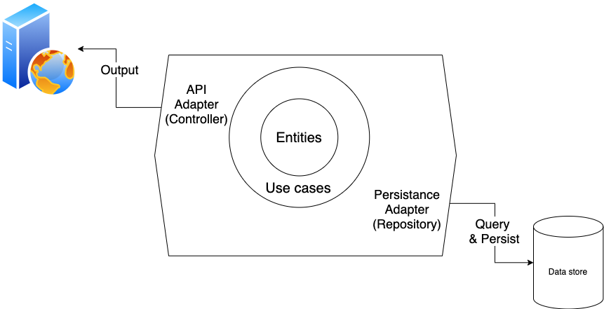

# Purchase Request API

This is a toy API for a simple purchasing system.

I built this to experiment with Hexagonal Architecture, Spring, and Kotlin.

## What it can do?

Imagine you are building are purchase requesting system where employees can request a budget from managers.

Here the specs for V0.1

- Employee can generate a purchase request with items and send it to their manager.
- Employee can see only their purchase request.
- Manager can see every purchase request sent to them.
- Manager can either approve, reject or send back the purchase request to the employee for future negotiation.

Simple enough, I guess

So here are APIs.

- POST /purchase_request --> Create a purchase request
- GET /purchase_requests --> List all purchase request I can view
- GET /purchase_request/{id} --> Get the detail of purchase request
- POST /purchase_request/{id}/approve --> Approve the purchase request
- POST /purchase_request/{id}/reject --> Reject the purchase request with reason (Manager only)
- POST /purchase_request/{id}/negotiate --> Negotiate the purchase request with comment (Manager only)

For the sake of simplicity: Let start by seeding 3 users

- Mark Zuckerburg as a manager
- Chris Likit as an employee
- James Harden as an employee

Let see how it goes

## Hexagonal Architecture in Nutshell

I believe the spririt of [Hexagonal arcitecture](<https://en.wikipedia.org/wiki/Hexagonal_architecture_(software)>) is an ability to create a core engine that is very independent to 3rd-party.

Quotes from Wikipedia:

> _The hexagonal architecture, or ports and adapters architecture, is an architectural pattern used in software design. It aims at creating loosely coupled application components that can be easily connected to their software environment by means of ports and adapters. This makes components exchangeable at any level and facilitates test automation._

### Input/Output Adapters

#### Controller

Controller is a layer where we connect the domain layer to the Web API. It handle the details of how to create a Web Server, JSON response, Input validation, Rate limiting (not applicable to this specific apps).

Whenever Controller need to query or do anything in the business domain, it will use `useCases` objects and methods, instead of knowing how to do or query itself.

Luckily, most of these details are handled in Spring Boot, so I was left to just write a minimal code.

### Repository

Repository is a layer where we connect the domain layer to a data source. The Repository knows how to communicate with Database, ideally in a reliable and performant way. Any detail about using data source, from how to create a simple query to how to rotating connection in connections pool. Repository knows.

Again, Spring JPA handle most of these stuff for us.

### Domain

### Entities

Entities is a data and operation inside our domain. In our case, User and Purchase Request. In DDD, entitiy is any business information that have a lifecycle, and the equality is identified by identity value rather than the content itself. For example: DateTime is not an entity because 2020-01-01 will never be as same as 2020-01-02, while PurchaseRequest#3 will always be the same PurchaseRequest#3 even if it is open, approved or reject. The business domain still perceived it as the same PurchaseRequest, even though content inside can be vary depends on time.

### Use case

UseCase is a set of operation allow inside the business domain. It responsible for connecting required adapters (Repository, Controller) with possibly multiple entities to achieve a business value. It can know some logic regarding of that specific business operation.

## Design Decision

### Entity creation is not allowed in the non-domain layer

When a user creates a purchase request, they must send some data to the Web API. Question: Should API level have the ability to create a PurchaseRequest entity itself?

There are two ways to handle this.

- We can set a rule where communication between the API and Domain layers must be done via an arbitrary data class. The benefit is that now API layer doesn't have to understand what the underlying entity is. It will be simply a data interface. We decouple the API layer and domain layer. The downside: Extra overhead for any entity change. eg. simply adding field in PurchaseRequest require us to change both entity and data classes,
- We can allow the API layer to initiate an entity and send it to the domain layer as input. It will be easier to add, rename, modify entity. But now, we coupled the API and domain. So any domain logic change can unintentionally possibly affect API layer.

Interesting decision to make. For this project, I will go with the first route. I believe the first route conforms more to the spirit of hexagonal architecture.

PS. A possible reason why the traditional Rails-style can be more productive for starting a new project. In Rails-style, you simply create a Model and Controller, and if Model and Controller change together 80% of the times, Rails will be more productive.

### Integration test in Domain Use Cases

Suppose we are assuming that the Domain layer will be consumed by multiple input/output stream, which is the real spirit of hexagonal architecture. In that case, it makes sense to do the integration test in the domain layer.

### Where to put logic of whether user can approved PR?

There are three possible places where

1. Create `User.CanApproved()` method
2. Embed as an if clause inside PurchaseRequestEntity
3. Embed as an if clause PurcahseReqeustUseCase

Three of them seems to all be valid, so let see what are we saying when we put in each of these place

- If I create a `User.CanApprove()` method, then I basically say to everyone that every domain should use this shared approve logic. To pain a concrete picture, this design is valid if the logic of approval is valid for both PurchaseRequest system and future Budgeting system. I incentivize every contributor to not reinventing any approval rights validating logic.
- If I put the `if` inside `PurchaseRequestEntity`, then I basically say that I reject any possibility of having approver as a non-manager of any kind.
- If I put the `if` inside `PurchaseRequestUseCase`, then I basically say that maybe in another set of use cases, it is acceptable to have a non-manager approver, maybe in another domain (eg. Auto-Approval from Some kind of smart engine AI use-case).

The first one seems to be invalid and premature. The second and third one seems to be equally valid, given that this is just a toy project.

I choose the second.

In real-life scenario, once you start to choose between option 2 and option 3, you have a question to ask the domain expert.

PS. This exercise's value is the thought process, not the implementation itself.

### Authentication

Use Spring Security in the most basic level.

## Note to self

Here is something I learned

### Auto-reloading dev workflow

In order to auto reload

- Add devtools dependency to gradle
- Run `gradle build --continuous` in one tab
- Run `gradle bootRun` in another tab

[Source](https://dzone.com/articles/continuous-auto-restart-with-spring-boot-devtools)

### Some comments I want to make in a future

- Rails style vs Hexagonal style
- The actual value of Hexagonal
- All design decisions I made
